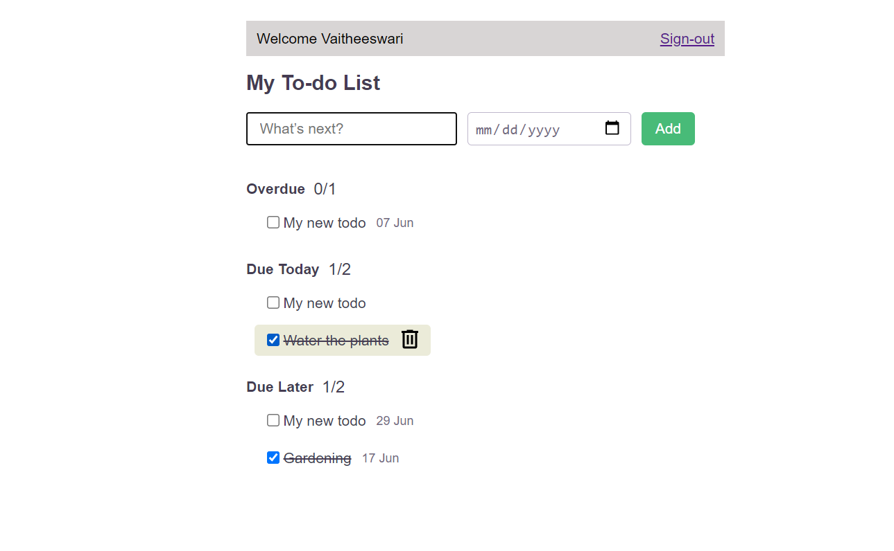

# TODO-MANAGER APP

The Todo Manager application is  a fully functioning SaaS application that can be used by any number of users on the web.

## The features present in the application are:

* Users will be able to sign-up, sign-in, and sign-out.

* A user can see and manage only their own todos and nobody else's.

* A user can add a new todo.

* A user can mark a todo completed or not .

* A user can delete  todos.

[HEROKU LINK](https://vaithi-todo-manager.herokuapp.com)

